# Student Wellness App

A mental wellness app designed to help students track their moods, write journal entries, meditate, and connect with peer support groups—all in a secure and supportive environment.

---

## 📝 Project Description

The Student Wellness App empowers students to:
- Log and reflect on their moods
- Maintain a private journal
- Access guided meditation and stress relief exercises
- Connect anonymously with peer support groups
- Quickly reach out to emergency contacts
- Set and track personal wellness goals
- **Upload and manage a profile picture**
- **Export their data for backup or review**

The app works offline for journaling and mood tracking, and features a modern, animated UI for an engaging experience.

---

## 🚀 Features

- **Mood Tracking & Journaling:** Log daily moods and write personal reflections.
- **Anonymous Peer Support Chat:** Secure, anonymous chat for students to support each other.
- **Guided Meditation & Stress Relief:** Relaxation exercises and breathing techniques.
- **Emergency Contact Integration:** Quick access to university counselors or helplines.
- **Offline Storage:** Store journals and mood logs locally.
- **Wellness Goals:** Set and track personal wellness goals.
- **Profile Picture Upload:** Upload and update your profile photo.
- **Data Export:** Export your mood and journal data for backup or review.
- **Custom Animations & UI Enhancements:** Smooth, modern interface.
- **Notifications:** Daily reminders and meditation prompts.
- **Additional Features:**
  - **Motivational Quotes** on the home screen
  - **App Settings** for theme, language, and notifications
  - **Block/Report** users in anonymous chat for safety

---

## 🖥️ Screen-by-Screen Description

### 1. Home Screen
- Quick access to all main features: Mood, Journal, Meditation, Anonymous Support, and Emergency.
- Motivational quote and featured meditation.

### 2. Mood Tracking Screen
- Select your current mood, rate its intensity, and add notes.
- View mood history and statistics.

### 3. Journal Screen
- Write, edit, and view personal journal entries.
- See a history of your reflections.

### 4. Meditation Screen
- Browse and start guided meditation sessions.
- Track completed sessions and ratings.

### 5. Anonymous Support Chat
- Join or create anonymous peer support chats.
- Send and receive messages securely and anonymously.
- Report or block inappropriate users.

### 6. Emergency Screen
- View a list of emergency contacts (e.g., university counseling, crisis hotline).
- Tap-to-call with confirmation dialog.
- Access emergency protocols for various situations.

### 7. Emergency Protocols Screen
- Expandable cards for each protocol (e.g., panic attack, crisis).
- Step-by-step instructions and direct call button.

### 8. Profile Screen
- View and edit your profile, interests, and university.
- **Upload and update your profile picture.**
- Access wellness goals and app settings.
- Export your data.

### 9. Wellness Goals
- Set, view, and track progress on personal wellness goals.

### 10. Settings
- Change theme, language, and notification preferences.

### 11. Statistics
- View visual summaries and analytics of your mood and wellness data.
- Track trends over time, such as mood patterns, journal activity, and meditation progress.
- Use insights to better understand and improve your mental wellness.

---

## 📱 How to Install the APK on Your Android Device

1. **Build or Download the APK**
   - The APK file is located at `apk/app-release.apk` in this repository.
   - You can also build it yourself using:
     ```sh
     flutter build apk --release
     ```
     The APK will be at `build/app/outputs/flutter-apk/app-release.apk`.

2. **Transfer the APK to Your Device**
   - Connect your Android device to your computer via USB, or use a cloud service (Google Drive, email, etc.) to transfer the APK file.

3. **Enable Installation from Unknown Sources**
   - On your Android device, go to **Settings > Security** (or **Settings > Apps & notifications > Special app access > Install unknown apps**).
   - Allow your file manager or browser to install unknown apps.

4. **Install the APK**
   - Open your file manager and navigate to the APK file.
   - Tap the APK file and follow the prompts to install.
   - You may see a warning—confirm to proceed.

5. **Open the App**
   - Once installed, you’ll find the Student Wellness App in your app drawer. Tap to open and enjoy!

> **Note:** You do not need to be connected to the Play Store to install or use the APK, but you must allow installation from unknown sources.

---

## 🛠️ Installation & Setup

1. **Clone the repository:**
   ```sh
   git clone https://github.com/YOUR_USERNAME/student_wellness_app.git
   cd student_wellness_app
   ```

2. **Install dependencies:**
   ```sh
   flutter pub get
   ```

3. **Run the app:**
   ```sh
   flutter run
   ```

4. **Build APK (for Android):**
   ```sh
   flutter build apk --release
   ```
   - The APK will be at `build/app/outputs/flutter-apk/app-release.apk`

5. **Firebase Setup:**
   - Add your `google-services.json` to `android/app/` if using Firebase.

---

## 📸 Screenshots

Below are some screenshots of the main features and screens of the app:

### Home Screen
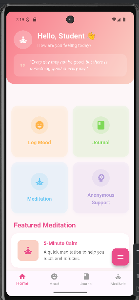

### Mood Tracking
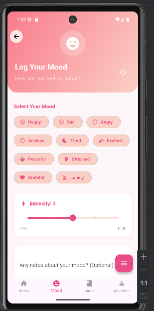
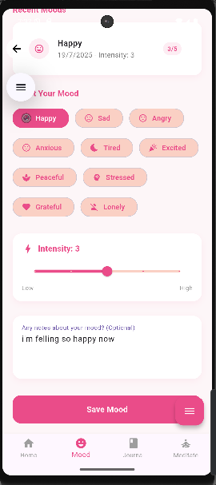
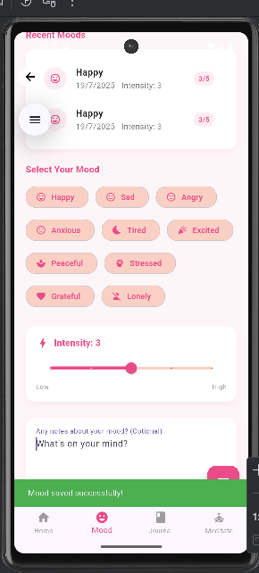
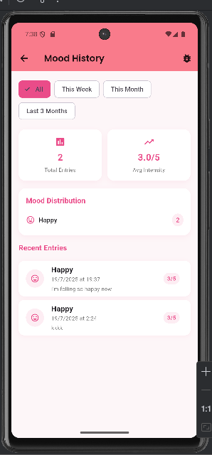


### Journal
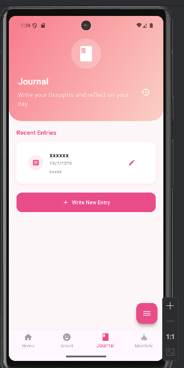
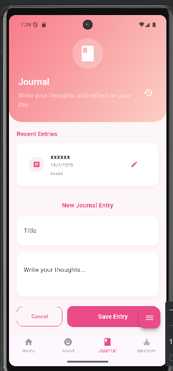
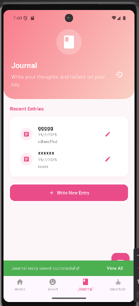
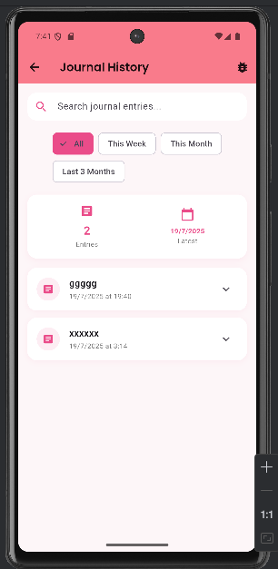
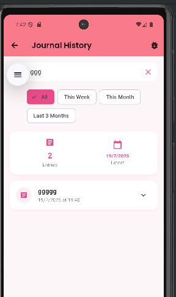


### Meditation
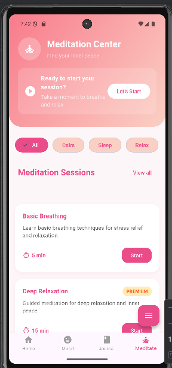
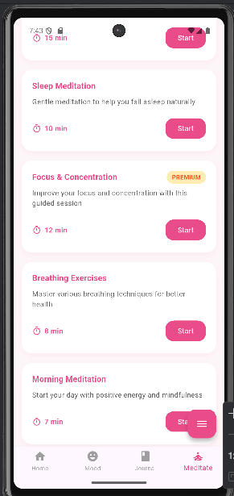
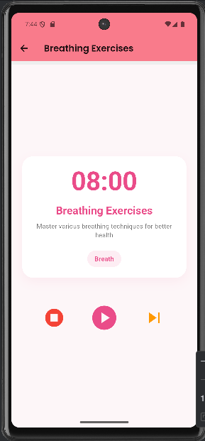
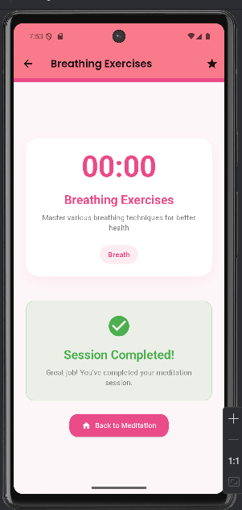

### Anonymous Support Chat
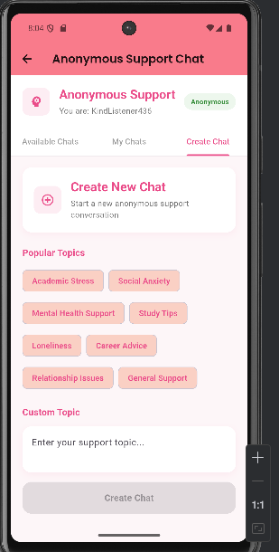
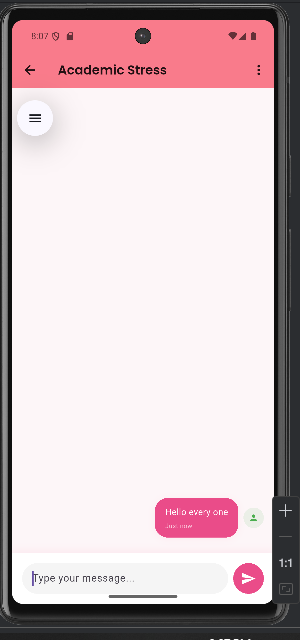

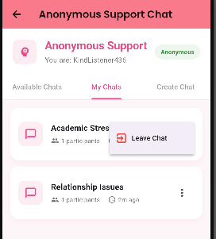
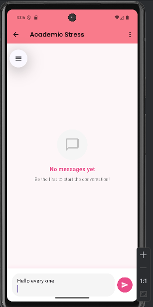


### Emergency Screen
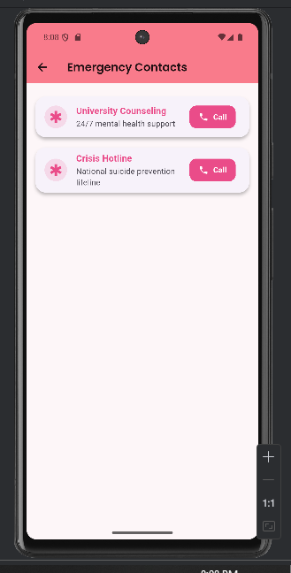


### Emergency Protocols
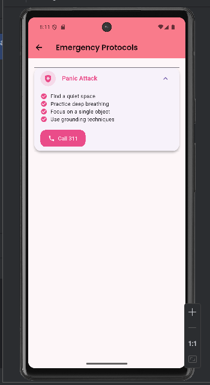

### Profile
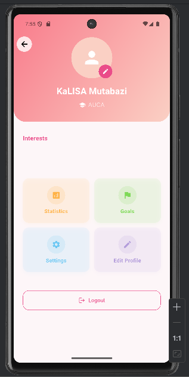
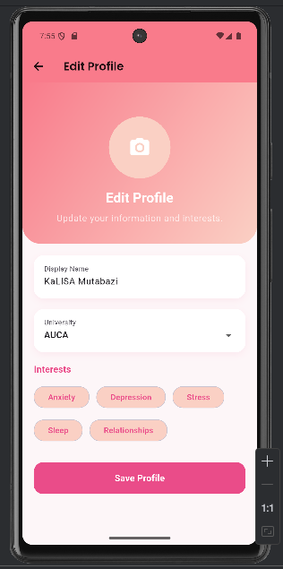
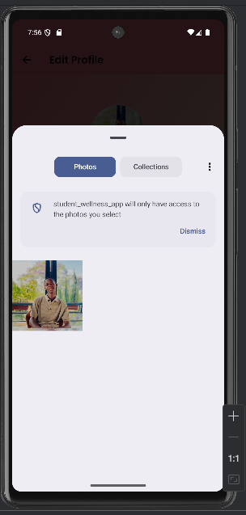

### Wellness Goal
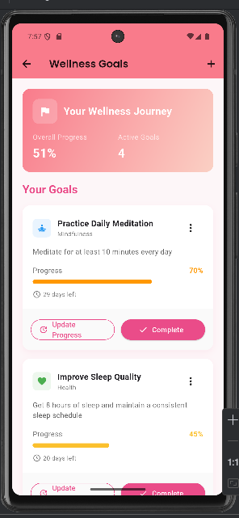
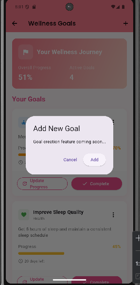

### Settings
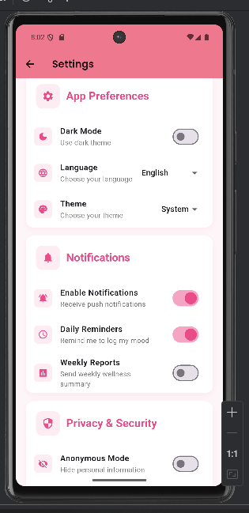

### Statistic
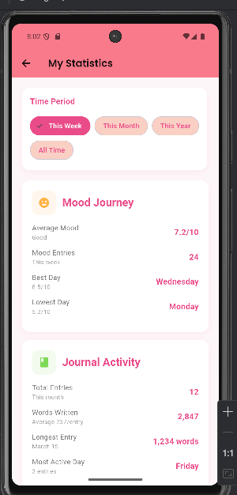


---

## 📬 Contact & Support

For questions or support, contact [mutabazikalisa9@gmail.com or https://github.com/kskalisa].

---

